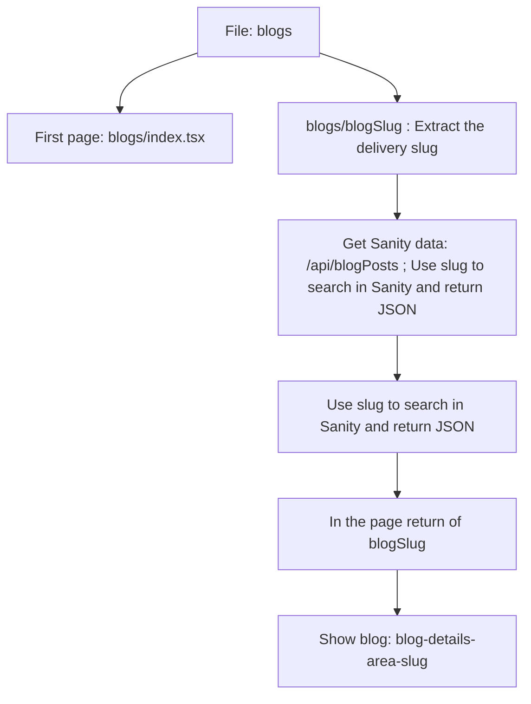

- file: blogs
    - first page: `blogs/index.tsx`
    - for url using slug: `blogs/headless-seo-getting-started`
        - process by `blogs/[blogSlug].tsx`
            - -> get sanity data using `/api/blogPosts.tsx`
            - -> `blogPosts.tsx` use slug to search in sanity and return as json to `WPPost`
            - -> in the page return of `[blogSlug].tsx`, using `blog-details-area-slug.tsx` to show blog.
